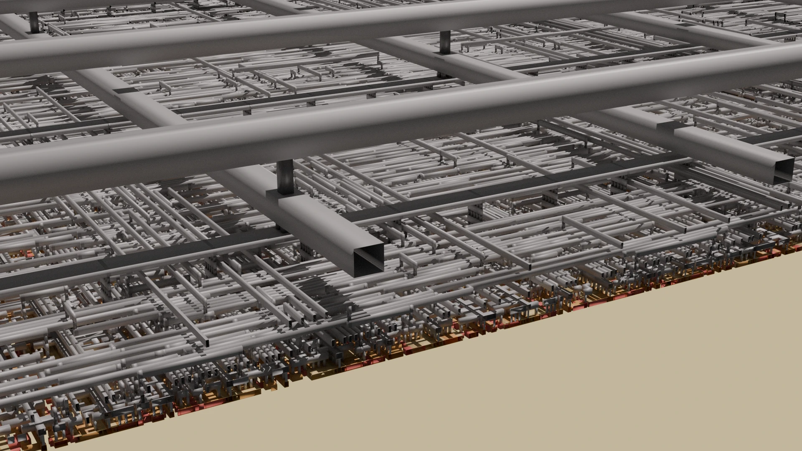
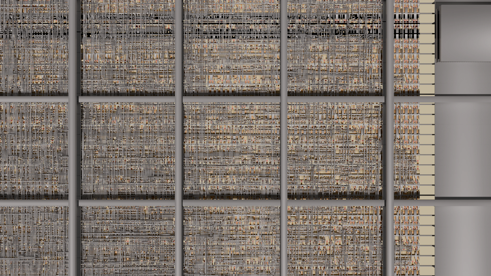
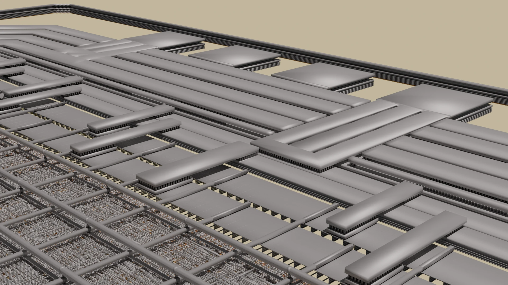
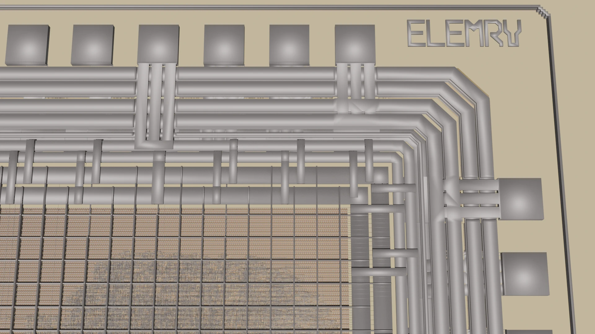

ElemRV - End-to-end Open-Source RISC-V MCU
==========================================

This project offers an end-to-end open-source RISC-V Microcontroller, fully implemented in SpinalHDL and design to work seamlessly with the OpenROAD toolchain. This MCU is tailored to use with the IHP Open SG13G2 PDK, providing a complete open-source solution from RTL to GDSII without any reliance on proprietary software.

Features
########

* **SpinalHDL Implementation**: The design is entirely written in SpinalHDL, without using Verilog or VHDL.
* **Open-Source Toolchain**: The project exclusively uses open-source tools, ensuring compatibility without proprietary dependencies.

  * **Design Verification**: Conducted using Yosys and nextpnr.

  * **Chip Layout**: Created using the OpenROAD flow.

* **RISC-V**: Powered by a VexRiscv RISC-V CPU with the RV32IC instruction set.
* **Zephyr RTOS**: Firmware based on Zephyr RTOS for efficient real-time operation.
* **Memory**: Supports up to one HyperRAM chip and executes code from external SPI Flash in XIP mode.
* **Interfaces**: Includes common low-speed interfaces such as GPIO, UART, I2C, SPI, and programmable I/Os.

Layout Rendering
################

View of standard cells with the power distribution network.

Top view of standard cells.

A closer look at the power and ground I/O cells located in the I/O ring.

Another look at the I/O ring with the ``ElemRV`` label.

Installation
############

This project uses Taskfile as its task runner tool. You can install Taskfile using Snap or an alternative package manager for your distribution (e.g., Ubuntu). Once installed, run the `install` task to download and set up all dependencies.

- Install Taskfile and virtualenv::

        sudo apt install virtualenv curl podman
        sudo sh -c "$(curl --location https://taskfile.dev/install.sh)" -- -d -b /usr/local/bin

- Set up the project::

        task install

- List all available tasks::

        task -a

**Note:** By default, the X-Server is required for the `view-klayout` and `view-openroad` tasks. On headless systems, you can bypass this requirement by adding `IS_HEADLESS=true` before the task command. This is particularly useful when accessing the system via SSH, as it allows you to run the container without the need for X-Server.

FPGA Flow
#########

Start by generating the necessary files for the ECPIX5 Board, then synthesize the design.

.. code-block:: text

    task fpga-prepare fpga-synthesize

Next, program the ECP5 FPGA with the synthesized bitstream.

.. code-block:: text

    task fpga-flash

ASIC Flow
#########

The ASIC flow closely resembles the FPGA flow. Begin by generating all required files, then proceed with chip layout creation and filler insertion.

.. code-block:: text

    task prepare layout filler

If the chip layout process fails, consult the **Known Issues** section for troubleshooting tips.

Finally, review the chip layout using OpenROAD or KLayout.

.. code-block:: text

    task view-klayout
    task view-openroad

Earlier stages of the layout process can also be reviewed in OpenROAD by passing the `stage` argument.

.. code-block:: text

    task view-openroad stage=6_final

Design Rule Checks
##################

Use the following tasks to perform Design Rule Checks (DRC) on the chip layout. Minimal checks can be run as follows:

.. code-block:: text

    task run-drc level=minimal
    task view-drc level=minimal

To run an enhanced rule set, use the standard DRC commands:

.. code-block:: text

    task run-drc
    task view-drc

Tape-out
########

The default task runs the complete RTL-to-GDSII tape-out flow in one step. The final GDS file undergoes a comprehensive DRC check and is prepared for tape-out.

.. code-block:: text

    task

Known Issues
############

- **M2.d Errors**: OpenROAD generates excessively small segments on M2 when connecting Via1 to Via2.
- **Fill Errors**: AFil.g2 and MxFil.h might fail because there is not enough metal fill in the chip core area.
- **X-Server**: If you encounter an error when running `view-klayout` or `view-openroad`, it may be due to permission restrictions with the X-Server. To resolve this, run the following command in your terminal to add the current user to the X-Server backend:

  .. code-block:: text

     xhost +si:localuser:$USER

License
#######

Copyright (c) 2024 Steffen Reith and Daniel Schultz. Released under the `GPLv3 license`_.

.. _GPLv3 license: COPYING.GPLv3
